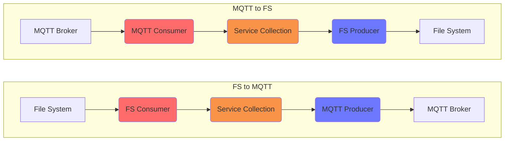

# MQTT Testing

[](https://github.com/interlok-testing/testing_mqtt/blob/develop/LICENSE)
[](https://github.com/interlok-testing/testing_mqtt/actions/workflows/gradle-build.yml)

Project tests interlok-mqtt features

## What it does

This project is very simple and contains two channels with one workflow each doing a simple MQTT to file system bridge.

The first workflow is listening on an MQTT topic and write the message on file system.

The second workflow is polling the file system for new files and send it's content to an MQTT topic.




## Getting started

* `./gradlew clean build`
* `(cd ./build/distribution && java -jar lib/interlok-boot.jar)`

The config is using a variables.properties to configure the MQTT host, topics and the file system directory.

```
mqttScheme=ws
mqttHost=broker.emqx.io
mqttPort=8083
mqttUrl=${mqttScheme}://${mqttHost}:${mqttPort}
fsDir=file://localhost/./messages/in
topicSource=source
topicDest=destination
```

## Try it

For simplicity I used a test MQTT broker made available by EMQX (https://www.emqx.com/en/mqtt/public-mqtt5-broker) but any MQTT broken can be used.

Once the adapter is up and running you can send a message to the topicSource and check that you receive the same message on the topicDest.
If you are using EMQX you can use their toolkit http://tools.emqx.io/.

